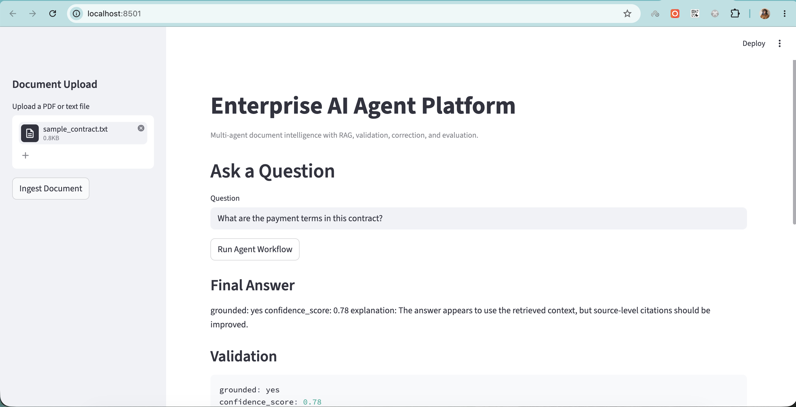
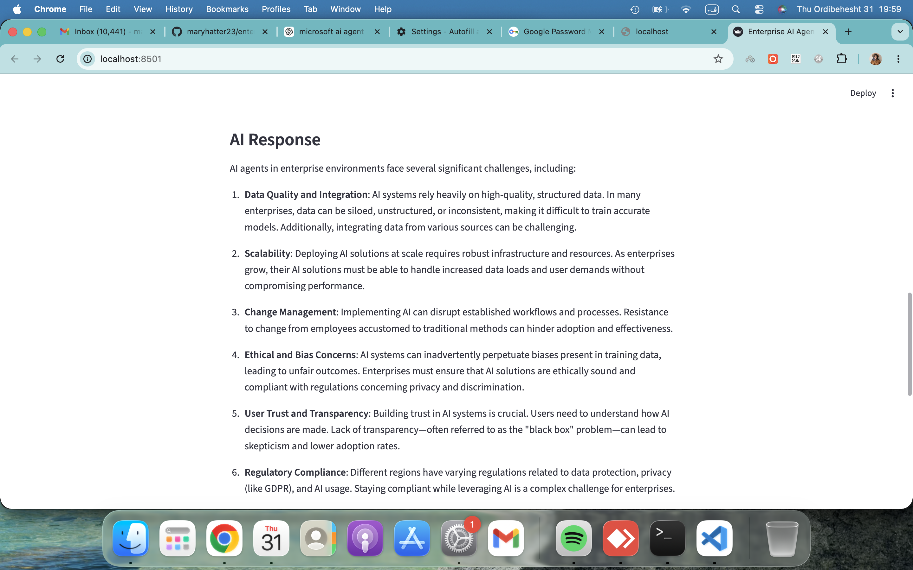
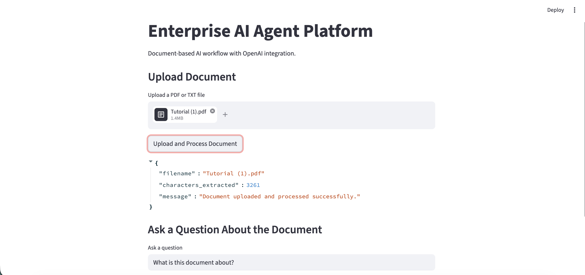

# enterprise-ai-agent-platform
ai-workflow-document-intelligence
# Enterprise AI Agent Platform

Production-style multi-agent AI workflow platform for enterprise document intelligence, validation, and retrieval-augmented reasoning.

---

## Features

- Multi-agent workflow orchestration
- Retrieval-Augmented Generation (RAG)
- Document ingestion pipeline
- Validation and groundedness checking
- Evaluation system for AI responses
- FastAPI backend
- Streamlit frontend
- Modular enterprise-style architecture

---
## UI Preview

### Initial UI



---

### Real OpenAI Response



---

### Document Upload and Q&A Workflow



---

## Architecture

Upload Document  
↓  
Text Extraction  
↓  
Chunking & Retrieval  
↓  
Retriever Agent  
↓  
Reasoning Agent  
↓  
Validation Agent  
↓  
Correction Agent  
↓  
Evaluation Layer  
↓  
Final Response  

---

## Tech Stack

- Python
- FastAPI
- Uvicorn
- Streamlit
- LangChain / LangGraph-style orchestration
- RAG pipelines
- Docker
- GitHub

---

## Current Capabilities

- Upload TXT/PDF documents
- Ask contextual questions
- Run AI workflow pipelines
- Validate response groundedness
- Generate evaluation metrics

---

## Future Improvements

- OpenAI API integration
- ChromaDB vector storage
- Real embeddings
- Citation tracing
- Advanced evaluation metrics
- Observability and logging
- Production deployment

---

## Run Locally

Create and activate a virtual environment:

```bash
python3 -m venv venv
source venv/bin/activate