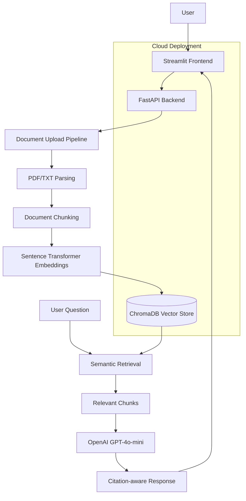

# enterprise-ai-agent-platform
ai-workflow-document-intelligence
# Enterprise AI Agent Platform

Production-style multi-agent AI workflow platform for enterprise document intelligence, validation, and retrieval-augmented reasoning.

---

## Features

- Multi-agent workflow orchestration
- Retrieval-Augmented Generation (RAG)
- Document ingestion pipeline
- Validation and groundedness checking
- Evaluation system for AI responses
- FastAPI backend
- Streamlit frontend
- Modular enterprise-style architecture

---
## UI Preview

### Initial UI


---

### Real OpenAI Response


---

### Document Upload and Q&A Workflow


---
## Live Demo

Frontend (Streamlit):
https://enterprise-ai-agent-platform-8hyseap2azqwdqtkqwcyt.streamlit.app

Backend API (Railway):
https://web-production-c1b1e.up.railway.app

API Docs:
https://web-production-c1b1e.up.railway.app/docs
---

## Architecture


---

## Tech Stack

- Python
- FastAPI
- Uvicorn
- Streamlit
- LangChain / LangGraph-style orchestration
- RAG pipelines
- Docker
- GitHub

---

## Current Capabilities

- Upload TXT/PDF documents
- Ask contextual questions
- Run AI workflow pipelines
- Validate response groundedness
- Generate evaluation metrics

---

## Features

- OpenAI-powered question answering
- PDF and TXT document upload
- Text extraction from uploaded documents
- Document chunking
- Embedding generation with Sentence Transformers
- ChromaDB vector storage
- Semantic retrieval over document chunks
- Citation-aware RAG pipeline with source metadata
- FastAPI backend
- Streamlit frontend

---

## Run Locally

Create and activate a virtual environment:

```bash
python3 -m venv venv
source venv/bin/activate